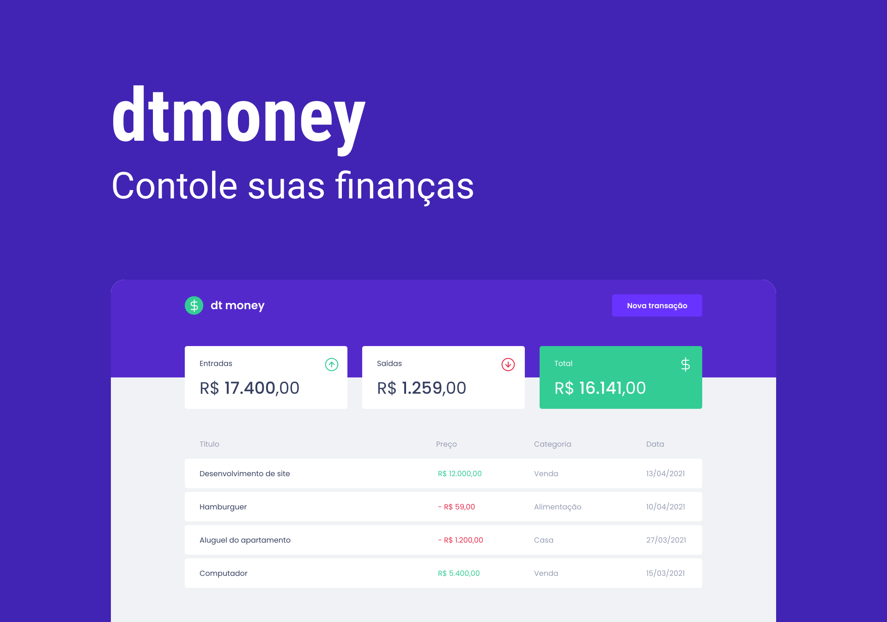

<h1 align="center">dtmoney</h1>

<p align="center">
  <a href="#-tecnologias">Tecnologias</a>&nbsp;&nbsp;&nbsp;|&nbsp;&nbsp;&nbsp;
  <a href="#instalando-e-usando">Instalando</a>&nbsp;&nbsp;&nbsp;|&nbsp;&nbsp;&nbsp;
  <a href="#-layout">Layout</a>
</p>

<h1>Projeto</h1>
<p>O dt money é uma aplicação para gerenciar suas finanças, cadastrado seus ganhos e gastos.</p>
<p align="center">
	
</p>

# 🛠 Tecnologias

- [vite](https://vitejs.dev/)
- [React](https://reactjs.org)
- [Typescript](https://typescriptlang.org/)
- [Styled Components](https://styled-components.com/)
- [MirageJS](https://miragejs.com/)
- [Axios](https://github.com/axios/axios)
- [Polished](https://polished.js.org/)

# Instalando e usando
```bash
# No terminal cole esse linha
git clone https://github.com/mateeusgl/dtmoney.git

# ou gh-cli
gh repo clone mateeusgl/dtmoney

# Acesse a pasta
cd dtmoney

# Instale as dependências
npm install | npm i

# Start na aplicação
npm run dev
```

# 🎨 Layout

Figma - https://www.figma.com/file/UQVoVu3AZ2YZkgX22YL7cv/dtmoney-Ignite?node-id=5154%3A131
